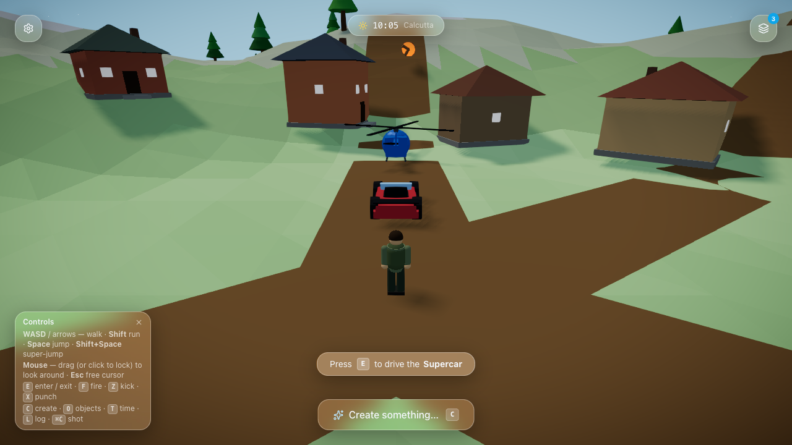

# Project Orbit AI 🌴🚗🤖

**Type it. AI builds it.** Project Orbit AI is an open-source, AI-driven third-person sandbox
game. Walk a pixel character through a low-poly world — jungle hills, dirt roads, a settlement, a
winding river — and **summon physics objects by describing them**: "create a supercar", "create
the Taj Mahal", "create a campfire". An AI model turns your words into real geometry + physics;
**bring your own key** from any major provider. If it drives, press **E** and drive it.



**[▶ Play in your browser](https://projectorbitai.vercel.app/play)** ·
**[⬇ Download the native app](https://github.com/Tarachand-Gupta/project-orbit/releases/latest)** (macOS / Linux) ·
**[Website](https://projectorbitai.vercel.app)**

## How it works

- **Typeahead**: known objects appear as ⚡ suggestions while you type and spawn **instantly**
  from a deterministic template engine — no API key, no network.
- **AI generation**: anything else is built part-by-part by an AI model — OpenAI, Anthropic,
  Gemini, Groq, OpenRouter, xAI (Grok), NVIDIA, Mistral, DeepSeek, or any OpenAI-compatible
  endpoint (bring your own key, via the Vercel AI SDK) — into a schema-validated **Object Spec**
  (low-poly primitives + physics tags + live controls). If the model fails, the local engine
  answers instead. Core mechanics never depend on a model.
- **Physics**: Rapier (Rust → WASM). Convex hulls, vehicles, fire propagation, ballistics.
- **Native app**: the same game ships as a real macOS/Linux desktop app (Zig + system WebView via
  the Vercel Native SDK) with retina rendering and FPS-style pointer capture. See
  [`orbit-native/`](orbit-native/).

## Quick start

```bash
npm install
npm run dev            # http://localhost:5191  (game at /play, landing page at /)
```

**Controls:** WASD / arrows walk · mouse look (click to lock, Esc frees) · Shift run · Space jump ·
**C** create · **E** enter/exit vehicles · **F** fire · **Z/X** kick/punch · **O/T/L** panels.

### AI generation (optional, bring-your-own-key)

The game defaults to the offline template engine and never needs a key. To let a model build
things, players open the **⚙ gear on the Create bar**, pick a provider (OpenAI, Anthropic,
Gemini, Groq, OpenRouter, xAI, NVIDIA, Mistral, DeepSeek, or a **Custom** OpenAI-compatible base
URL), paste **their own API key**, and choose a model — the model list loads live from the
provider once the key is present (`POST /api/models`). Keys live only in the player's browser and
are sent only to the chosen provider (the serverless proxy in [`api/generate.ts`](api/generate.ts)
relays them per-request; the deployment stores nothing). **The public deployment ships no server
keys** — and this is enforced in code, not just policy: [`api/generate.ts`](api/generate.ts)
ignores `GEMINI_API_KEY` unless `ALLOW_SERVER_KEYS=1` is also set, so a stray env var can't
silently drain an owner's key on this public, unauthenticated endpoint. (The proxy also
rate-limits per client, refuses cross-origin browser calls, and DNS-checks endpoints against
private addresses.)

For local development you *may* put a key in `.env` (gitignored) so the built-in Gemini provider
works without pasting into the UI. See [`.env.example`](.env.example):

```
GEMINI_API_KEY=...           # dev convenience only — never deployed
```

## Scripts

| Command | What it does |
| --- | --- |
| `npm run dev` | Dev server on port 5191 |
| `npm run build` | Type-check + production build |
| `npm run test` | Vitest unit tests (pure logic: generation, physics math, spec schema) |
| `npm run test:e2e` | Playwright headless tests (walk, drive, fly, spawn, persistence) |
| `npm run test:all` | Both |

First e2e run needs the browser: `npx playwright install chromium`.

## Programmatic API

`window.game` — `spawn`, `list`, `get`, `setConfig`, `describe`, `getLogs`, `save`, `load`,
`setProvider`, `setTimeOfDay`, … for power-users and AI agents (agents read `getLogs()` to
self-correct). See [`CLAUDE.md`](CLAUDE.md) for the architecture map.

## Repository layout

```
src/            the game (React + R3F + Rapier) and the landing page (src/site/)
api/            Vercel serverless generation proxy (production twin of the dev middleware)
orbit-native/   native desktop shell (Zig + WebView) — has its own CLAUDE.md
tests/e2e/      Playwright suite
docs/           engineering notes (performance posture)
```

## Contributing

PRs welcome — start with [CONTRIBUTING.md](CONTRIBUTING.md). Branch model: `dev` is the default
target; `main` is the release branch (merges to `main` publish a GitHub release and deploy the
site). Maintainer playbook: [MAINTAINING.md](MAINTAINING.md).

## Roadmap

- ✅ **Iterate on existing objects** — select something you spawned and refine it with a
  follow-up prompt ("make the wheels bigger") right in its controls panel; the model reworks
  that exact object in place. (Shipped — needs an AI provider.)
- WebGPU / physics-worker adoption criteria: see [docs/performance.md](docs/performance.md).

## Performance posture

WebGL2 everywhere (the only GPU API that is stable on every OS/browser today), aggressive
instancing, low-DPR pixel-art rendering, main-thread Rapier. Why not WebGPU/workers yet — and
what would earn them — is written up in [docs/performance.md](docs/performance.md).

## License

[MIT](LICENSE) © 2026 Tarachand Gupta
